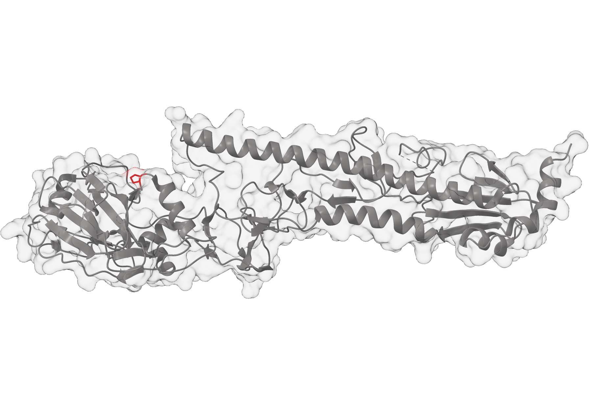

# Project #2. “Why did I get the flu?”. Deep sequencing, error control, p-value, viral evolution.

# Prerequisites
### To install all dependencies, you must have [Mamba](https://github.com/conda-forge/miniforge) installed on your system.  

🟢 **Create the environment with the following command and activate it:**
```bash
mamba env create -f environment.yml -n practicum_project_2
mamba activate practicum_project_2
```  

# 1.  Inspect the data from your roommate
🟢 **Automatic installation of all components:**  
> Run **setup.sh** file.  
```bash
sh setup.sh
```  

# 2. Align your roommate’s data to the reference sequence

> ### Download the gene reference manually via the [link](https://www.ncbi.nlm.nih.gov/nuccore/KF848938.1?report=fasta) and place it in the /refs folder.

# 🟢 Now you can run the **run.sh** file for automatic commands execution.  
```bash
sh run.sh
```  

<details> 
<summary>Show code</summary>

```bash
bwa index refs/sequence.fasta
bwa mem refs/sequence.fasta reads/SRR1705851.fastq.gz | samtools view -Sb | samtools sort -o alignments/roommate_sorted.bam
```
</details>

# 3. Look for common variants with VarScan  
<details> 
<summary>Show code</summary>

```bash
samtools index alignments/roommate_sorted.bam
samtools depth alignments/roommate_sorted.bam > alignments/roommate_sorted_coverage.txt
cut -f3 alignments/roommate_sorted_coverage.txt | sort -nr | head -1 > alignments/roommate_sorted_max_depth.txt
```
</details>

🤔 **Task:** *Provide number of identified variants in your report*  
✅ **Answer:**  5 variants:  
KF848938.1 72 A G - ACA > ACG; Thr > Thr; Syn  
KF848938.1 117 C T - GCC > GCT; Ala > Ala; Syn  
KF848938.1 774 T C - TTT > TTC; Phe > Phe; Syn  
KF848938.1 999 C T - GGC > GGT; Gly > Gly; Syn  
KF848938.1 1260 A C - CTA > CTC; Leu > Leu; Syn  

🤔 **Task:** *What do these mutations do?*  
✅ **Answer:** Nothing. They are synonymous.  

🤔 **Task:** *Could they be what allowed your roommate’s virus to escape the antibodies in your body from the flu vaccine?*  
✅ **Answer:** No  

# 4. Look for common variants with VarScan  
<details> 
<summary>Show code</summary>

```bash
samtools mpileup -f refs/sequence.fasta alignments/roommate_sorted.bam -d 44522 > mpileup/my.mpileup
varscan mpileup2snp mpileup/my.mpileup --min-var-freq 0.95 --variants --output-vcf 1 > vcf/VarScan_results_95.vcf
cat vcf/VarScan_results_95.vcf | awk 'NR>24 {print $1, $2, $4, $5}' > vcf/VarScan_results_95_variants.txt
varscan mpileup2snp mpileup/my.mpileup --min-var-freq 0.001 --variants --output-vcf 1 > vcf/VarScan_results_0.1.vcf
cat vcf/VarScan_results_0.1.vcf | awk 'NR>24 {print $1, $2, $4, $5}' > vcf/VarScan_results_0.1_variants.txt
```
</details>

🤔 **Task:** *How many variants are reported back now, and how abundant are they?*  
✅ **Answer:** Variants count: 21. The abundance of new variants is < 1%.  

# 5. Inspect and align the control sample sequencing data  
<details> 
<summary>Show code</summary>

```bash
bwa mem refs/sequence.fasta reads/SRR1705858.fastq.gz | samtools view -Sb | samtools sort -o alignments/SRR1705858_sorted.bam
bwa mem refs/sequence.fasta reads/SRR1705859.fastq.gz | samtools view -Sb | samtools sort -o alignments/SRR1705859_sorted.bam
bwa mem refs/sequence.fasta reads/SRR1705860.fastq.gz | samtools view -Sb | samtools sort -o alignments/SRR1705860_sorted.bam
gunzip -c reads/SRR1705858.fastq.gz | grep '^@' | wc -l > reads/SRR1705858.fastq.reads_count.txt
gunzip -c reads/SRR1705859.fastq.gz | grep '^@' | wc -l > reads/SRR1705859.fastq.reads_count.txt
gunzip -c reads/SRR1705860.fastq.gz | grep '^@' | wc -l > reads/SRR17058560.fastq.reads_count.txt
samtools index alignments/SRR1705858_sorted.bam
samtools index alignments/SRR1705859_sorted.bam
samtools index alignments/SRR1705860_sorted.bam
samtools depth alignments/SRR1705858_sorted.bam > alignments/SRR1705858_sorted_coverage.txt
samtools depth alignments/SRR1705859_sorted.bam > alignments/SRR1705859_sorted_coverage.txt
samtools depth alignments/SRR1705860_sorted.bam > alignments/SRR1705860_sorted_coverage.txt
cut -f3 alignments/SRR1705858_sorted_coverage.txt | sort -nr | head -1 > alignments/SRR1705858_sorted_max_depth.txt
cut -f3 alignments/SRR1705859_sorted_coverage.txt | sort -nr | head -1 > alignments/SRR1705859_sorted_max_depth.txt
cut -f3 alignments/SRR1705860_sorted_coverage.txt | sort -nr | head -1 > alignments/SRR17058560_sorted_max_depth.txt
samtools mpileup -f refs/sequence.fasta alignments/SRR1705858_sorted.bam -d 44522 > mpileup/SRR1705858_sorted.mpileup
samtools mpileup -f refs/sequence.fasta alignments/SRR1705859_sorted.bam -d 44522 > mpileup/SRR1705859_sorted.mpileup
samtools mpileup -f refs/sequence.fasta alignments/SRR1705860_sorted.bam -d 44522 > mpileup/SRR1705860_sorted.mpileup
```
</details>

🤔 **Task:** *Calculate how many reads are in each file.*  
✅ **Answer:**  
SRR1705858.fastq.gz - 256586  
SRR1705859.fastq.gz - 233327  
SRR1705860.fastq.gz - 249964  

🤔 **Task:** *Take a rough estimate of the coverage in your samples*  
✅ **Answer:**  I did that. What should I have answered?

# 6. Use VarScan to look for rare variants in the reference files.  
<details> 
<summary>Show code</summary>

```bash
varscan mpileup2snp mpileup/SRR1705858_sorted.mpileup --min-var-freq 0.001 --variants --output-vcf 1 > vcf/SRR1705858_0.1.vcf
varscan mpileup2snp mpileup/SRR1705859_sorted.mpileup --min-var-freq 0.001 --variants --output-vcf 1 > vcf/SRR1705859_0.1.vcf
varscan mpileup2snp mpileup/SRR1705860_sorted.mpileup --min-var-freq 0.001 --variants --output-vcf 1 > vcf/SRR1705860_0.1.vcf
```
</details>

# All subsequent steps (second part of step 6, steps 7 and 8) were performed in scripts/compare_frequences.ipynb. The HTML version of the script is compare_frequences.html

# 🏆 Results
## 🧬 Roommate's variants table

|   POS | REF   | ALT   |   FREQ |    HGVSp    | Consequence | Epitope |
|-------|-------|-------|--------|-------------|-------------|---------|
|    72 | A     | G     |  99.96 | p.Thr24Thr  |  Synonymous |    -    |
|   117 | C     | T     |  99.82 | p.Ala39Ala  |  Synonymous |    -    |
|   307 | C     | T     |   0.94 | p.Pro103Ser |  Missense   |    D    |
|   774 | T     | C     |  99.96 | p.Phe258Phe |  Synonymous |    -    |
|   999 | C     | T     |  99.86 | p.Gly333Gly |  Synonymous |    -    |
|  1260 | A     | C     |  99.94 | p.Leu420Leu |  Synonymous |    -    |
|  1458 | T     | C     |   0.84 | p.Tyr486Tyr |  Synonymous |    -    |

# 9. In the end of the lab report, please write a conclusion  

## Conclusion

> All current influenza vaccines are designed to generate immunity against hemagglutinin. Our data reveal an amino acid substitution, p.Pro103Ser, in the D epitope of this protein in our isolate. This amino acid change (antigenic drift) causes antibodies to lose their ability to bind to the antigen (hemagglutinin). Consequently, our immune system was not prepared for the virus strain carrying this substitution.  

> All other identified genetic variants are synonymous and do not alter the protein's amino acid sequence.  

> ### Identification of true genetic variants  

>> True genetic variants were identified by comparing the variant frequency (FREQ) in the study sample to the frequency in control samples. A variant was considered real if its frequency in the study sample exceeded the mean frequency in the control samples by more than three standard deviations.  

> ### Suggestions for additional error control  

>> The following additional error-control measures are proposed:

>> 1.  **Reducing the number of amplification cycles in PCR.** Fewer cycles result in fewer potential errors during DNA amplification.
>> 2.  **Optimizing cluster density during NGS sequencing (library concentration control).** The sequencer's camera can distinguish optical signals more easily when they are sufficiently spaced. Fewer clusters increase the distance between them. However, too few clusters is also detrimental, as it reduces coverage. An optimal number must be determined.

# *Optional Extra-Credit Challenge Question  
*1) How would you calculate the ACTUAL average coverage per position for one of our data sets, only for mapped reads, and taking into consideration the fact that the reads can be not all the same length? You can use a script or software that someone else wrote - in this case please explain how it works, and how you would call it at the command line. Include your approach, and your answer, if you found one, at the end of your report, after the discussion.*
> I used **samtools depth** for this purpose.
```bash
samtools depth alignments/SRR1705858_sorted.bam > alignments/SRR1705858_sorted_coverage.txt
samtools depth alignments/SRR1705859_sorted.bam > alignments/SRR1705859_sorted_coverage.txt
samtools depth alignments/SRR1705860_sorted.bam > alignments/SRR1705860_sorted_coverage.txt
```

*3) If you are familiar with the PDB database, you can try to explore VMD, PyMOL, Jmol, RasMol, or some other PDB-viewing application to provide an image of the H3N2 hemagglutinin molecule and highlight amino acid changes you’ve found.*

> [Protein structure source](https://www.rcsb.org/structure/4WE9). Software - ChimeraX 1.8.

